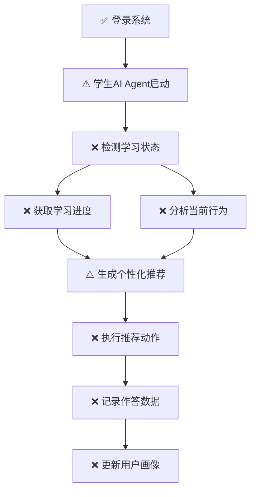
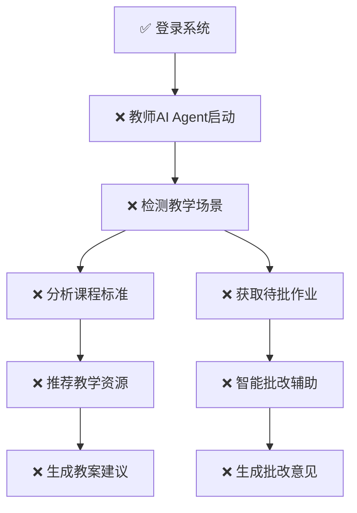
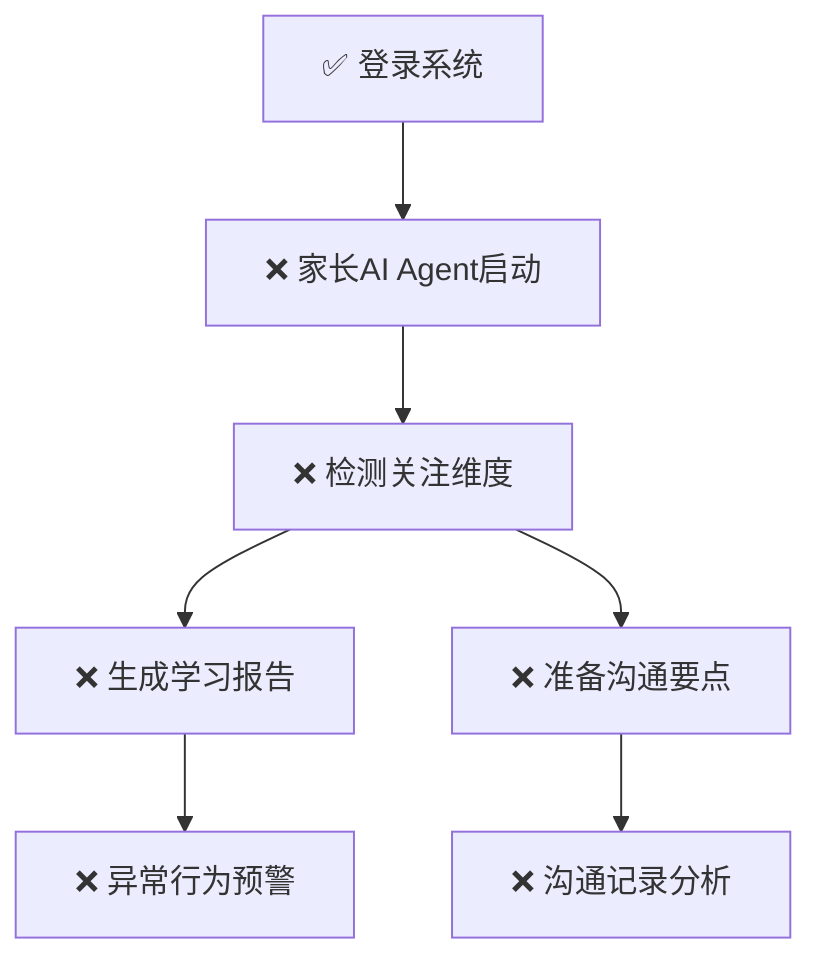
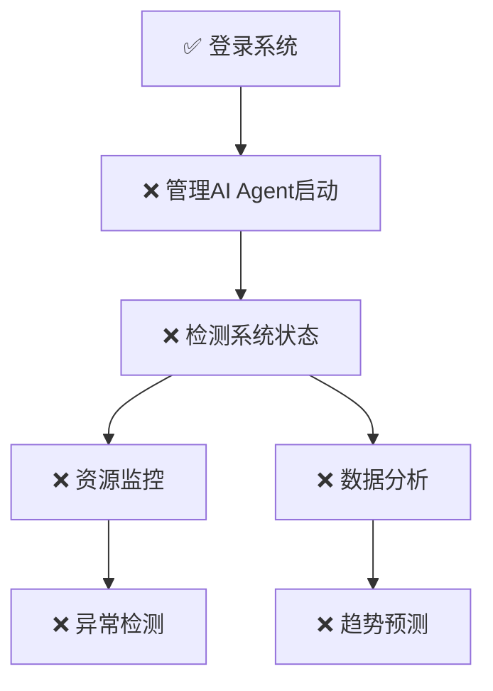

# K12智能教育平台 AI Agent实施现状分析

## 🎯 **与AI Agent流程图的匹配度分析**

### ✅ **已实现的AI Agent组件 (40%)**

#### 1. **基础架构层面** 
- ✅ **中央知识库设计**: 完整的数据库结构，包含用户行为、学习数据、教育内容
- ✅ **多角色系统**: 学生、教师、家长、管理员四个角色的基础框架
- ✅ **数据模型**: 用户画像、学习行为分析、推荐系统的数据表设计
- ✅ **API接口框架**: AI聊天、推荐、分析的接口定义

#### 2. **部分AI功能实现**
- ✅ **AI对话API**: `/api/v1/ai/chat` 基础聊天接口
- ✅ **推荐API**: `/api/v1/ai/recommendations` 个性化推荐接口  
- ✅ **分析API**: `/api/v1/ai/analysis` 学习分析接口
- ✅ **前端AI组件**: AIChat组件、推荐展示组件

### ⚠️ **缺失的关键AI Agent功能 (60%)**

#### 1. **学生AI Agent** - 缺失度：70%


**缺失功能：**
- ❌ 实时学习状态检测
- ❌ 智能推荐执行引擎
- ❌ 自动化学习行为记录
- ❌ 动态用户画像更新

#### 2. **教师AI Agent** - 缺失度：80%


**缺失功能：**
- ❌ 教学场景智能识别
- ❌ AI辅助批改系统
- ❌ 智能教案生成
- ❌ 教学资源推荐引擎

#### 3. **家长AI Agent** - 缺失度：90%


**缺失功能：**
- ❌ 自动学习报告生成
- ❌ 异常行为预警系统
- ❌ 家校沟通策略生成
- ❌ 干预建议推送

#### 4. **管理员AI Agent** - 缺失度：85%


**缺失功能：**
- ❌ 智能系统监控
- ❌ 自动异常检测
- ❌ 数据趋势预测
- ❌ 优化建议生成

## 🛠️ **AI Agent完善工作计划**

### **阶段一：核心AI引擎建设 (2-3周)**

#### 第1周：AI协调引擎开发
```python
# backend/app/ai/engines/coordination_engine.py
class AICoordinationEngine:
    """AI协调引擎 - 实现流程图中的核心调度功能"""
    
    def __init__(self):
        self.knowledge_base = CentralKnowledgeBase()
        self.user_agents = {}
        self.context_manager = ContextManager()
    
    async def initialize_agent(self, user_id: int, role: str):
        """根据用户角色初始化对应的AI Agent"""
        if role == 'student':
            agent = StudentAIAgent(user_id, self.knowledge_base)
        elif role == 'teacher':
            agent = TeacherAIAgent(user_id, self.knowledge_base)
        elif role == 'parent':
            agent = ParentAIAgent(user_id, self.knowledge_base)
        elif role == 'admin':
            agent = AdminAIAgent(user_id, self.knowledge_base)
        
        self.user_agents[user_id] = agent
        return agent
    
    async def process_user_action(self, user_id: int, action: Dict):
        """处理用户行为，触发AI Agent流程"""
        agent = self.user_agents.get(user_id)
        if not agent:
            return None
        
        # 更新用户行为日志
        await self.knowledge_base.update_behavior_log(user_id, action)
        
        # 触发AI Agent处理
        response = await agent.process_action(action)
        
        # 更新中央知识库
        await self.knowledge_base.update_from_agent_response(user_id, response)
        
        return response
```

#### 第2周：学生AI Agent实现
```python
# backend/app/ai/agents/student_agent.py
class StudentAIAgent(BaseAgent):
    """学生AI Agent - 实现完整的学生学习支持流程"""
    
    async def startup(self):
        """Agent启动流程"""
        # 检测学习状态
        learning_state = await self.detect_learning_state()
        
        if learning_state.is_new_session:
            # 获取学习进度
            progress = await self.get_learning_progress()
            context = {"type": "new_session", "progress": progress}
        else:
            # 分析当前行为
            behavior = await self.analyze_current_behavior()
            context = {"type": "continuing", "behavior": behavior}
        
        # 生成个性化推荐
        recommendations = await self.generate_personalized_recommendations(context)
        
        return {
            "state": learning_state,
            "recommendations": recommendations,
            "actions": await self.prepare_actions(recommendations)
        }
    
    async def detect_learning_state(self):
        """检测学习状态 - 对应流程图S3"""
        last_activity = await self.knowledge_base.get_last_activity(self.user_id)
        
        if not last_activity or (datetime.now() - last_activity.timestamp).hours > 1:
            return LearningState(is_new_session=True, last_activity=last_activity)
        else:
            return LearningState(is_new_session=False, last_activity=last_activity)
    
    async def generate_personalized_recommendations(self, context):
        """生成个性化推荐 - 对应流程图S6"""
        # 获取学生画像
        profile = await self.knowledge_base.get_student_profile(self.user_id)
        
        # 分析薄弱知识点
        weak_points = await self.analyze_weak_knowledge_points()
        
        # 获取学习偏好
        preferences = await self.get_learning_preferences()
        
        # AI生成推荐
        prompt = self.build_recommendation_prompt(profile, weak_points, preferences, context)
        ai_response = await self.llm_client.generate(prompt)
        
        return self.parse_recommendations(ai_response)
    
    async def execute_recommendations(self, recommendations):
        """执行推荐动作 - 对应流程图S7"""
        actions = []
        
        for rec in recommendations:
            if rec.type == "practice_questions":
                # 推送练习题 - S7a
                questions = await self.get_recommended_questions(rec.knowledge_points)
                actions.append({
                    "type": "push_questions",
                    "data": questions,
                    "knowledge_points": rec.knowledge_points
                })
            
            elif rec.type == "video_content":
                # 播放讲解视频 - S7b
                videos = await self.get_recommended_videos(rec.topic)
                actions.append({
                    "type": "play_video",
                    "data": videos,
                    "topic": rec.topic
                })
            
            elif rec.type == "mistake_analysis":
                # 错题分析 - S7c
                mistakes = await self.analyze_mistakes()
                actions.append({
                    "type": "mistake_analysis",
                    "data": mistakes
                })
        
        return actions
    
    async def record_learning_data(self, action_type: str, data: Dict):
        """记录学习数据 - 对应流程图S8"""
        learning_record = {
            "user_id": self.user_id,
            "action_type": action_type,
            "timestamp": datetime.now(),
            "data": data
        }
        
        # 记录到中央知识库
        await self.knowledge_base.record_learning_data(learning_record)
        
        # 实时更新用户画像
        await self.update_user_profile(learning_record)
```

#### 第3周：教师AI Agent实现
```python
# backend/app/ai/agents/teacher_agent.py
class TeacherAIAgent(BaseAgent):
    """教师AI Agent - 实现智能教学支持"""
    
    async def startup(self):
        """教师AI Agent启动"""
        # 检测教学场景
        teaching_context = await self.detect_teaching_context()
        
        if teaching_context.mode == "preparation":
            # 备课模式
            return await self.preparation_mode_flow()
        elif teaching_context.mode == "grading":
            # 批改模式  
            return await self.grading_mode_flow()
        else:
            # 日常模式
            return await self.daily_mode_flow()
    
    async def detect_teaching_context(self):
        """检测教学场景 - 对应流程图T3"""
        current_time = datetime.now()
        
        # 检查是否有待批改作业
        pending_homeworks = await self.get_pending_homeworks()
        
        # 检查是否在备课时间
        is_preparation_time = await self.is_preparation_time(current_time)
        
        # 检查当前教学任务
        current_tasks = await self.get_current_teaching_tasks()
        
        if pending_homeworks and len(pending_homeworks) > 5:
            return TeachingContext(mode="grading", priority="high")
        elif is_preparation_time:
            return TeachingContext(mode="preparation", priority="normal")
        else:
            return TeachingContext(mode="daily", priority="normal")
    
    async def grading_mode_flow(self):
        """批改模式流程 - 对应流程图T5→T7→T9"""
        # 获取待批作业
        pending_homeworks = await self.get_pending_homeworks()
        
        grading_suggestions = []
        for homework in pending_homeworks:
            # 智能批改辅助
            ai_analysis = await self.ai_grading_assistant(homework)
            
            grading_suggestions.append({
                "homework_id": homework.id,
                "student_id": homework.student_id,
                "ai_score": ai_analysis.suggested_score,
                "ai_comments": ai_analysis.suggested_comments,
                "key_points": ai_analysis.key_points_analysis,
                "improvement_suggestions": ai_analysis.improvement_suggestions
            })
        
        return {
            "mode": "grading",
            "pending_count": len(pending_homeworks),
            "grading_suggestions": grading_suggestions,
            "batch_grading_available": len(pending_homeworks) > 10
        }
    
    async def ai_grading_assistant(self, homework):
        """AI批改辅助 - 智能分析作业"""
        # 获取标准答案
        standard_answer = await self.get_standard_answer(homework.question_id)
        
        # AI分析学生答案
        prompt = f"""
        分析以下学生作业：
        题目：{homework.question.content}
        标准答案：{standard_answer}
        学生答案：{homework.student_answer}
        
        请提供：
        1. 建议分数 (0-100)
        2. 详细评语
        3. 知识点掌握分析
        4. 改进建议
        """
        
        ai_response = await self.llm_client.analyze(prompt)
        return self.parse_grading_analysis(ai_response)
    
    async def preparation_mode_flow(self):
        """备课模式流程 - 对应流程图T4→T6→T8"""
        # 分析课程标准
        course_standards = await self.analyze_course_standards()
        
        # 推荐教学资源
        recommended_resources = await self.recommend_teaching_resources(course_standards)
        
        # 生成教案建议
        lesson_plan_suggestions = await self.generate_lesson_plan_suggestions(
            course_standards, recommended_resources
        )
        
        return {
            "mode": "preparation",
            "course_standards": course_standards,
            "recommended_resources": recommended_resources,
            "lesson_plan_suggestions": lesson_plan_suggestions,
            "differentiated_teaching": await self.generate_differentiated_teaching_suggestions()
        }
```

### **阶段二：智能推荐引擎完善 (2周)**

#### 第4周：推荐算法实现
```python
# backend/app/ai/engines/recommendation_engine.py
class IntelligentRecommendationEngine:
    """智能推荐引擎 - 实现个性化推荐"""
    
    async def generate_student_recommendations(self, student_id: int):
        """为学生生成个性化推荐"""
        # 1. 获取学生画像
        profile = await self.get_student_profile(student_id)
        
        # 2. 分析学习行为
        learning_behavior = await self.analyze_learning_behavior(student_id)
        
        # 3. 识别薄弱环节
        weak_points = await self.identify_weak_points(student_id)
        
        # 4. 生成推荐
        recommendations = []
        
        # 知识点推荐
        for weak_point in weak_points:
            questions = await self.recommend_questions_for_knowledge_point(
                weak_point.id, profile.difficulty_preference
            )
            recommendations.append({
                "type": "knowledge_reinforcement",
                "knowledge_point": weak_point,
                "questions": questions,
                "priority": weak_point.urgency_score
            })
        
        # 学习路径推荐
        learning_path = await self.generate_learning_path(student_id, weak_points)
        recommendations.append({
            "type": "learning_path",
            "path": learning_path,
            "estimated_time": learning_path.total_time
        })
        
        # 资源推荐
        resources = await self.recommend_learning_resources(profile, weak_points)
        recommendations.append({
            "type": "learning_resources",
            "resources": resources
        })
        
        return recommendations
    
    async def recommend_questions_for_knowledge_point(self, knowledge_point_id: str, difficulty_level: int):
        """为特定知识点推荐题目"""
        # 基于学生能力和知识点关联度推荐
        candidate_questions = await self.get_candidate_questions(knowledge_point_id)
        
        # AI评分算法
        scored_questions = []
        for question in candidate_questions:
            score = await self.calculate_question_score(question, difficulty_level)
            scored_questions.append((question, score))
        
        # 排序并返回top推荐
        scored_questions.sort(key=lambda x: x[1], reverse=True)
        return [q[0] for q in scored_questions[:10]]
```

#### 第5周：实时行为分析
```python
# backend/app/ai/engines/behavior_analysis_engine.py
class RealTimeBehaviorAnalysisEngine:
    """实时行为分析引擎"""
    
    async def analyze_learning_session(self, user_id: int, session_data: Dict):
        """分析学习会话"""
        analysis = {
            "focus_level": await self.calculate_focus_level(session_data),
            "learning_efficiency": await self.calculate_efficiency(session_data),
            "knowledge_absorption": await self.estimate_absorption(session_data),
            "engagement_score": await self.calculate_engagement(session_data)
        }
        
        # 生成实时建议
        if analysis["focus_level"] < 0.6:
            analysis["suggestions"] = ["建议休息5分钟", "尝试换个学习环境"]
        elif analysis["learning_efficiency"] < 0.5:
            analysis["suggestions"] = ["调整学习策略", "重新复习基础知识"]
        
        return analysis
    
    async def detect_learning_patterns(self, user_id: int):
        """检测学习模式"""
        # 获取历史学习数据
        history = await self.get_learning_history(user_id, days=30)
        
        # 分析学习习惯
        patterns = {
            "peak_learning_hours": self.find_peak_hours(history),
            "preferred_content_types": self.analyze_content_preferences(history),
            "learning_pace": self.calculate_learning_pace(history),
            "retention_rate": self.calculate_retention_rate(history)
        }
        
        return patterns
```

### **阶段三：跨角色协同实现 (1-2周)**

#### 第6周：跨角色数据流实现
```python
# backend/app/ai/coordination/cross_role_coordinator.py
class CrossRoleCoordinator:
    """跨角色协同协调器"""
    
    async def student_to_teacher_data_flow(self, student_id: int):
        """学生数据到教师分析 - 对应流程图中S9→T11"""
        # 获取学生学习数据
        student_data = await self.get_student_learning_data(student_id)
        
        # 获取该学生的教师
        teachers = await self.get_student_teachers(student_id)
        
        for teacher in teachers:
            # 为教师生成学情分析报告
            analysis_report = await self.generate_student_analysis_for_teacher(
                student_data, teacher.subject_id
            )
            
            # 推送到教师仪表盘
            await self.push_to_teacher_dashboard(teacher.id, analysis_report)
    
    async def teacher_to_parent_report_flow(self, class_id: int):
        """教师分析到家长报告 - 对应流程图中T11→P4"""
        # 获取班级学情分析
        class_analysis = await self.get_class_analysis(class_id)
        
        # 获取家长列表
        parents = await self.get_class_parents(class_id)
        
        for parent in parents:
            # 为家长生成个性化报告
            parent_report = await self.generate_parent_report(
                parent.children_ids, class_analysis
            )
            
            # 发送给家长
            await self.send_to_parent(parent.id, parent_report)
    
    async def system_notification_flow(self, admin_alert: Dict):
        """系统通知流程 - 对应流程图中AD6→T2"""
        if admin_alert["severity"] == "high":
            # 高优先级通知直接推送给相关教师
            affected_teachers = await self.get_affected_teachers(admin_alert["scope"])
            
            for teacher in affected_teachers:
                await self.notify_teacher_urgently(teacher.id, admin_alert)
```

### **阶段四：前端AI交互完善 (1周)**

#### 第7周：前端AI组件增强
```typescript
// frontend/src/components/ai/AIAgentDashboard.tsx
import React, { useEffect, useState } from 'react';
import { Card, Badge, Timeline, Button, notification } from 'antd';
import { aiAPI } from '@/api/ai';

const AIAgentDashboard: React.FC = () => {
  const [agentStatus, setAgentStatus] = useState('inactive');
  const [recommendations, setRecommendations] = useState([]);
  const [realtimeAnalysis, setRealtimeAnalysis] = useState(null);

  useEffect(() => {
    // 启动AI Agent
    initializeAIAgent();
    
    // 设置实时数据更新
    const interval = setInterval(updateRealtimeAnalysis, 30000); // 30秒更新一次
    
    return () => clearInterval(interval);
  }, []);

  const initializeAIAgent = async () => {
    try {
      setAgentStatus('initializing');
      
      // 启动AI Agent
      const response = await aiAPI.initializeAgent();
      
      if (response.success) {
        setAgentStatus('active');
        setRecommendations(response.data.recommendations);
        
        notification.success({
          message: 'AI学习助手已启动',
          description: '为您准备了个性化学习建议'
        });
      }
    } catch (error) {
      setAgentStatus('error');
      notification.error({
        message: 'AI助手启动失败',
        description: '请刷新页面重试'
      });
    }
  };

  const updateRealtimeAnalysis = async () => {
    try {
      const analysis = await aiAPI.getRealtimeAnalysis();
      setRealtimeAnalysis(analysis.data);
      
      // 检查是否有新推荐
      if (analysis.data.hasNewRecommendations) {
        const newRecs = await aiAPI.getLatestRecommendations();
        setRecommendations(prev => [...newRecs.data, ...prev]);
      }
    } catch (error) {
      console.error('Failed to update realtime analysis:', error);
    }
  };

  return (
    <div className="ai-agent-dashboard">
      <Card
        title={
          <div className="flex items-center gap-2">
            <span>AI学习助手</span>
            <Badge 
              status={agentStatus === 'active' ? 'processing' : 'default'} 
              text={agentStatus === 'active' ? '运行中' : '离线'}
            />
          </div>
        }
        extra={
          <Button 
            type="primary" 
            onClick={initializeAIAgent}
            loading={agentStatus === 'initializing'}
          >
            {agentStatus === 'active' ? '重新启动' : '启动助手'}
          </Button>
        }
      >
        {realtimeAnalysis && (
          <div className="mb-6">
            <h4>实时学习分析</h4>
            <div className="grid grid-cols-2 gap-4">
              <div>
                <span className="text-gray-600">专注度：</span>
                <span className={`font-bold ${realtimeAnalysis.focusLevel > 0.7 ? 'text-green-600' : 'text-orange-600'}`}>
                  {(realtimeAnalysis.focusLevel * 100).toFixed(0)}%
                </span>
              </div>
              <div>
                <span className="text-gray-600">学习效率：</span>
                <span className={`font-bold ${realtimeAnalysis.efficiency > 0.7 ? 'text-green-600' : 'text-orange-600'}`}>
                  {(realtimeAnalysis.efficiency * 100).toFixed(0)}%
                </span>
              </div>
            </div>
            
            {realtimeAnalysis.suggestions?.length > 0 && (
              <div className="mt-4 p-3 bg-blue-50 rounded">
                <h5 className="text-blue-800 mb-2">💡 实时建议</h5>
                <ul className="text-blue-700 text-sm">
                  {realtimeAnalysis.suggestions.map((suggestion, index) => (
                    <li key={index}>• {suggestion}</li>
                  ))}
                </ul>
              </div>
            )}
          </div>
        )}

        <div>
          <h4>AI推荐</h4>
          <Timeline
            items={recommendations.slice(0, 5).map(rec => ({
              children: (
                <div>
                  <div className="font-medium">{rec.title}</div>
                  <div className="text-sm text-gray-600">{rec.description}</div>
                  <div className="mt-2">
                    <Button size="small" type="primary">
                      开始学习
                    </Button>
                  </div>
                </div>
              ),
              color: rec.priority === 'high' ? 'red' : 'blue'
            }))}
          />
        </div>
      </Card>
    </div>
  );
};

export default AIAgentDashboard;
```

## 📈 **实施优先级建议**

### **高优先级 (立即实施)**
1. **学生AI Agent核心流程** - 直接影响用户体验
2. **实时推荐引擎** - 系统核心价值
3. **智能批改辅助** - 教师痛点解决

### **中优先级 (第二阶段)**
1. **教师AI Agent完整流程**
2. **跨角色数据协同**
3. **家长AI预警系统**

### **低优先级 (最后实施)**
1. **管理员AI运维系统**
2. **高级分析功能**
3. **AI对话能力增强**

## 🎯 **预期效果**

完成AI Agent系统后，将实现：

1. **学生端**：真正的个性化学习体验，实时学习指导
2. **教师端**：智能教学助手，大幅提升教学效率
3. **家长端**：自动化学习监督，及时预警干预
4. **管理端**：智能系统运维，数据驱动决策

这样的实施将使你的K12平台真正成为一个"智能"教育系统，而不仅仅是一个传统的管理平台。